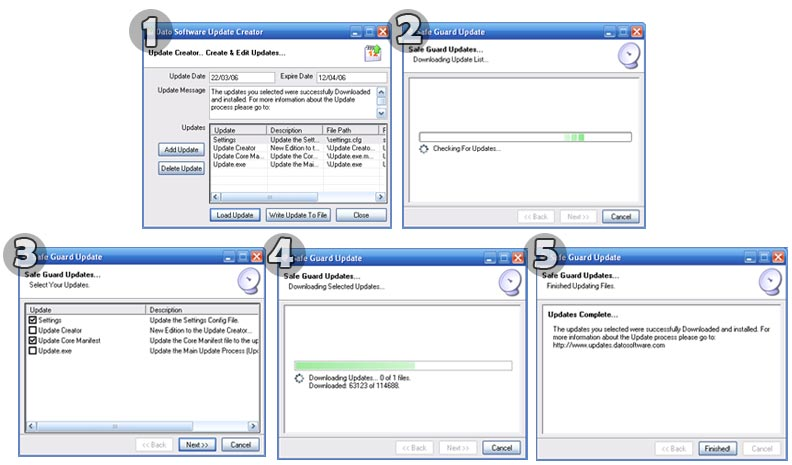



## Application Updater

### Description

Create Updates for your applications, so your users can get the most out of there products. This easy Update utility will, download updates for your application, with a few clicks of the mouse.

Featuring a nice easy to use interface, (user side) and a simple update creator&#8230; you can completely customize your updates.

The updater will download using the default internet connection, so larger companies using proxy servers, will be able to update also.

Please leave comments, and vote for this project, and many thanks to the people who shared their code, to help me with this project.
 
### More Info
 

             |
---                |---
**Submitted On**   |2006-03-20 16:20:18
**By**             |[Dave Nedved](https://github.com/Planet-Source-Code/PSCIndex/blob/master/ByAuthor/dave-nedved.md)
**Level**          |Intermediate
**User Rating**    |4.8 (77 globes from 16 users)
**Compatibility**  |VB 5\.0, VB 6\.0
**Category**       |[Complete Applications](https://github.com/Planet-Source-Code/PSCIndex/blob/master/ByCategory/complete-applications__1-27.md)
**World**          |[Visual Basic](https://github.com/Planet-Source-Code/PSCIndex/blob/master/ByWorld/visual-basic.md)
**Archive File**   |[Applicatio1981703202006\.zip](https://github.com/Planet-Source-Code/dave-nedved-application-updater__1-64738/archive/master.zip)

